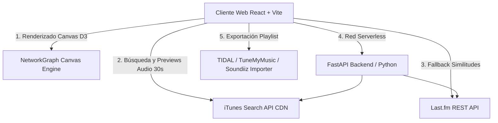

# ARCHITECTURE: MusicMap 🌊 — Documento de Arquitectura de Sistema

## 1. Diagrama de Arquitectura de Alto Nivel

---

## 2. Componentes del Frontend (React 18 + Vite)

### `src/App.jsx`
- Componente raíz que orquesta los estados globales de la aplicación:
  - `graphData` (`nodes`, `links`): Grafo activo en pantalla.
  - `selectedNode`: Nodo del artista activo en el sidebar.
  - `userCountry`: País detectado o seleccionado.
  - `nodesLimit`: Cantidad de afines mostrados (6, 10, 15).
  - `playlistCart`: Arreglo de temas guardados en la lista de reproducción.
  - `isCartModalOpen`: Estado modal de la consola de playlist.

### `src/components/NetworkGraph.jsx`
- Motor de renderizado en **HTML5 Canvas (2D)** respaldado por la librería `d3-force`.
- **Lógica de Físicas:**
  - `forceLink`: Distancias ajustadas por peso de similitud y bandera local/global.
  - `forceManyBody`: Fuerza de repulsión entre nodos (`charge = -300`).
  - `forceCollide`: Prevención de solapamiento visual entre nodos.
- **Renderizado de Canvas:** Dibujo de anillos concéntricos punteados, pulso animado de selección y enlaces de 3 colores (`#10b981`, `#8b5cf6`, `#00d2ff`).

### `src/components/HeaderControl.jsx`
- Barra superior flotante con estética Glassmorphism.
- Búsqueda con autocompletado en tiempo real vía iTunes API.
- Selectores de país (`userCountry`), densidad de red (`nodesLimit`), min similitud y filtro local/global.
- Botón del carrito con contador dinámico de canciones `🛒 Playlist (N)`.

### `src/components/ArtistSidebar.jsx`
- Panel lateral deslizable para el artista seleccionado.
- Consulta dinámica a la API de iTunes para cargar las **Top 20 canciones reales**.
- Botones `+` por canción con validación inmediata contra el estado `playlistCart`.
- Radar de Afinidad Multidimensional (gráficos de barras desglosados).

### `src/components/PlaylistCartModal.jsx`
- Consola de gestión de la playlist acumulada.
- Permite la reordenación manual (`⬆`/`⬇`), eliminación de temas y prueba de audio.
- Exportación en triple formato:
  - Archivo `.csv` estructurado (`Track Name, Artist Name, Album Name`) para TIDAL.
  - Archivo `.m3u` universal.
  - Formato texto para portapapeles.
- Banner guiado para sincronización en 1 clic con **TuneMyMusic** y **Soundiiz**.

---

## 3. Componentes del Backend (FastAPI / Python)

### `backend/main.py`
- Servidor REST en FastAPI con soporte CORS para el cliente React.
- Endpoint GET `/api/network`: Recibe `artist`, `user_country`, `limit` y retorna la estructura del grafo JSON.

### `backend/services/lastfm_service.py` & `audio_service.py`
- `lastfm_service.py`: Realiza peticiones a `artist.getsimilar` y `artist.gettoptags` usando `LASTFM_API_KEY`.
- `audio_service.py`: Cliente HTTP para consultar clips de audio de 30 segundos en los servidores CDN de iTunes.

---

## 4. Estrategia de Despliegue (Vercel CDN)
- **Frontend SPA:** Compilado mediante `vite build` generando artefactos optimizados en `dist/`.
- **Serverless Fallback:** Si la API de FastAPI no responde o se encuentra en reposo, el cliente React ejecuta peticiones directas desde el navegador a la API pública de Last.fm e iTunes, garantizando 100% de disponibilidad.
